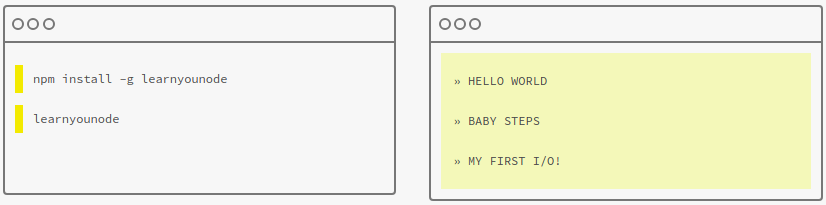
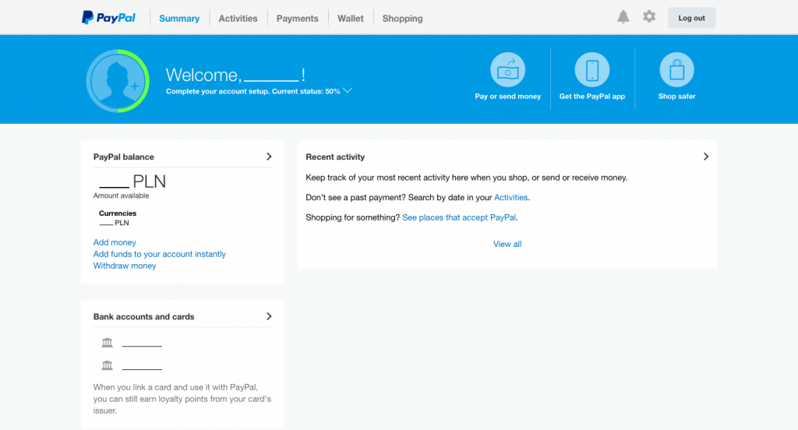
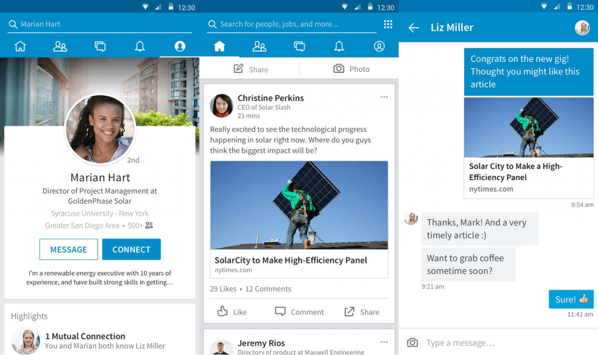
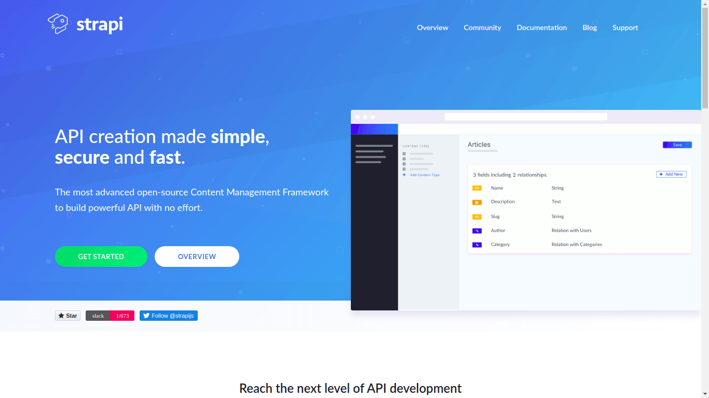

# Node.js Dasar

--------------------------------------------------------------------------------

## JavaScript dan Node.js

Sudah tahu JavaScript kan?

Sebuah bahasa pemrograman yang biasanya berjalan di bagian frontend atau client-side seperti browser.

Node.js itu secara sederhananya, merupakan platform JavaScript yang dapat berjalan di backend atau server-side, di komputer kita secara langsung.

Bisa sebagai program, aplikasi web, ataupun API.

Node.js (atau Node) dibuat pertama kali oleh Ryan Dahl pada tahun 2009.

Kini di-maintain oleh Node.js foundation dengan berbagai developer, bisa dilihat di GitHub-nya https://github.com/nodejs/node.

Definisi resmi dari situsnya menyatakan bahwa...

"Node.js® is a JavaScript runtime built on Chrome's V8 JavaScript engine. Node.js uses an event-driven, non-blocking I/O model that makes it lightweight and efficient. Node.js' package ecosystem, npm, is the largest ecosystem of open source libraries in the world."

Wow!

Oke santai aja, minimal kita tahu dulu berbagai istilah tersebut.

--------------------------------------------------------------------------------

## Instalasi

Mari kita lakukan instalasi Node.js di komputer kita melalui terminal.

```sh
# di debian/ubuntu
$ sudo apt install node
# di fedora/centos
$ sudo yum install node
```

Kita juga bisa pakai cara lainnya sesuai petunjuk yang ada di situsnya https://nodejs.org

Setelah itu coba cek versi `node` yang terinstal.

```sh
$ node -v
v8.9.0
```

--------------------------------------------------------------------------------

## Studi Kasus

Node.js bisa untuk apa aja?

### Command Line (CLI) Tool

Program untuk belajar mandiri seperti [NodeSchool](https://nodeschool.io).



### Web App

Beberapa situs dan perusahaan.





### REST API

API yang RESTful.



--------------------------------------------------------------------------------

## Node REPL (Read-Eval-Print-Loop)

### JavaScript di REPL

Kita bisa langsung mengeksekusi code JavaScript dengan menjalankan `node` di terminal.

```sh
$ node
> console.log('Hello')
Hello
> 1+1
2
> const text = "Hello"
undefined
> text
'Hello'
```

### Namespace Global

Secara default, Node memiliki beberapa variabel global yang dapat diakses dan dimodifikasi, seperti `global`, `process`, dll

--------------------------------------------------------------------------------

## File JavaScript sebagai program Node

Mari kita buat program JavaScript sederhana di dalam file yang dapat dijalankan oleh Node.

Buatlah file `index.js` di suatu direktori lalu isi melalui code editor.

```js
const TEXT = "Hello World"

function log(string) {
  console.log(string)
}

log(TEXT)
```

Jalankan dengan Node.

```sh
$ node index.js
Hello World
```
